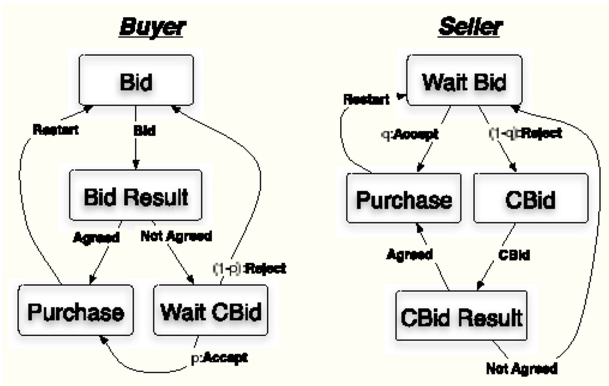

# Alternating Offers Protocol (Rubenstein)
##### Team Members
* Aniket Dhuri (adhuri@ncsu.edu)
* Ian Drosos (izdrosos@ncsu.edu)
* Karan Jadhav (kjadhav@ncsu.edu)

##### Date : December 07 , 2016  

### Abstract  

Bargaining between buyers and sellers is an activity that has been around since the dawn of civilization. Both parties ideally want low and high prices and try to agree on a price somewhere in between. The large number of decisions that affect the bargaining and the non-deterministic nature of this process’s model, make finding the best solutions difficult and model simulation a slow process. This project made use of prism model simulator to simulate the model and used three different genetic algorithms namely GA,NSGA2 and SPEA2  to find the best decision sets for the buyer-seller model. It also used parallelism and early termination to improve the overall run time of running optimizers on the model.

### Keywords
1. **Prism** : PRISM is a probabilistic model checker, a tool for formal modelling and analysis of systems that exhibit random or probabilistic behaviour.
2. **GA** : Genetic Algorithm is a method for solving both constrained and unconstrained optimization problems based on a natural selection process that mimics biological evolution.
3. **NSGA2** : Non-dominated sorting genetic algorithm for multi objective optimization that makes use of multiple frontiers and primary/secondary sorting.
4. **SPEA2** : Strength pareto evolutionary algorithm for multi objective optimization that uses dominance count and an archive,which is a set of good solutions.
5. **Spread** : How distant each point of a population is from its neighbours
6. **IGD** : Distance between the ideal and obtained pareto front.
7. **Hypervolume** : The volume inside the pareto frontiers.
8. **DEAP** : Distributed Evolutionary Algorithms in Python (DEAP) is a novel evolutionary computation framework for rapid prototyping and testing of ideas.
9. **SCOOP** : Scalable COncurrent Operations in Python (SCOOP) is a distributed task module allowing concurrent parallel programming on various environments, from heterogeneous grids to supercomputers. 

### Introduction
The buyer-seller model depends on many decisions such as buyer/seller initial price, reserved price, strategy, time deadline, etc. The utility value depends on the value at which the buyer and seller agreed for purchase as well as on the time when the agreement was made.The utility value would be higher for purchase value made earlier. The prism model we used had 15 decisions and generated 3 objectives. The large number of decisions in this model was a major challenge undertaken in this project as it becomes increasingly difficult to explore the large solution space. In addition to this, the model simulation took several hours to complete due to the simulation overhead caused by prism simulation. This led us to pursue a new objective to improve the run time by using parallelism, load balancing and early termination.

### Background
#### Rubinstein’s Bargaining Model
The bargaining model features alternating offers through an infinite time horizon where two individuals have several possible contractual agreements before them. The standard model has following elements-

1. Two players - Buyer and Seller.
2. Unlimited offers to reach consensus until one player accepts an offer
3. Alternating offers - first player makes an offer and if second player rejects, the game moves to the next period where second player makes an offer, and so on.
4. Delays are costly since utility value decreases as time progresses.

### Prism Model
The model used in this project is based on the Rubinstein’s Alternating Offers protocol negotiation framework. The model used was already implemented as a Discrete Time Markov Chain model in the PRISM language, a simple state based language to be run on prism model checker tool.

1. In this, both buyer and seller bargain over an item, proposing offers or counter offers until number of steps configured.
2. Disagreement is the worst outcome and players prefer any agreement at least as much as disagreement.
3. Players seek to maximize utility. For two outcomes of the same value, the one with lesser time has higher utility.

### Model states

The model can have the following states as seen in the figure above:

1. Wait Bid : Seller awaiting a bid
2. Bid : Buyer proposing a bid
3. Purchase : Either seller or buyer agreeing to the proposed value
4. Bid Result : Seller’s response on buyer’s bid
5. Wait CBid : Buyer awaiting seller’s counter offer after bid rejection
6. CBid : Counter bid thrown by seller after rejection of buyer’s bid
7. CBid Result : Buyer’s response on seller’s counter bid

The buyer makes a bid and if the seller agrees purchase is completed else waits for counter bid (cbid). If counter bid is rejected , the buyer bids again.
The seller waits for a bid and if accepted purchase is done, else makes a counter bid and the process continues till either the seller or buyer agrees to a bid or cbid. 

### Strategy
The buyer and seller follow two strategies - Conceder (if the player is willing to yield a lot in the early phase of negotiation) and Boulder (if a player is willing to concede considerably only when it's time deadline is approaching). The Strategy can be Linear or nonlinear.
